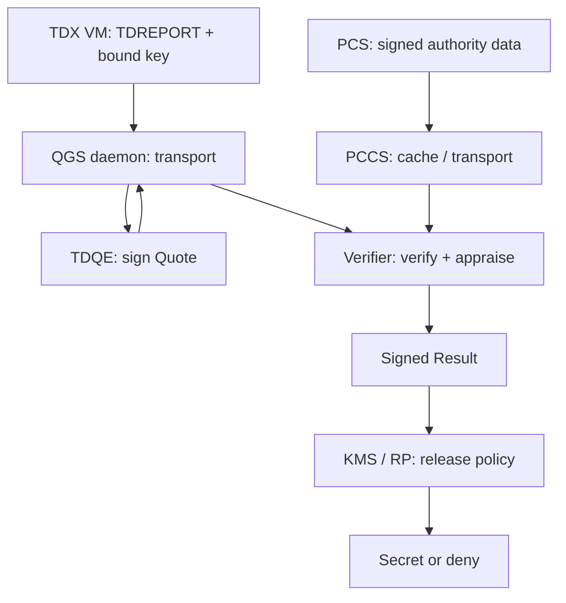

# Intel-rats Point result

## One-line Point

Intel TDX Remote Attestation lets an evidence appraisal service verify a TDX VM's hardware report against organizational criteria without fully trusting the cloud operator, then lets a key-management service release a secret only when its separate, explicit policy accepts that result.

Intel-rats is a strong visual aid for learning this decision structure and its failure boundaries, but it is not a deployable Quote-verification reference implementation.

## Domain model

The passing model keeps five boundaries explicit:

1. TDX protects and measures a whole Trust Domain; a Quote does not independently identify an inner container or prove that its code is bug-free.
2. QGS transports and coordinates Quote generation, while TDQE signs the Quote; they are not the same trust role.
3. Intel PCS is the signed authority-data source, while PCCS is a cache and transport layer whose bytes still require chain, status, and freshness checks.
4. The Verifier appraises Evidence, while the Relying Party or KMS makes the asset-release decision under a separate policy.
5. Freshness, request/audience binding, public-key binding, proof of possession, authenticated Results, and one-time atomic state transitions are deployment obligations, not automatic properties of a valid Quote.

## Blind comparison

Point first produced a project-blind strong-model coverage hypothesis for Intel TDX Remote Attestation. An independent domain agent corrected it against RFC 9334 and current Intel TDX/DCAP sources. A separate agent mapped Intel-rats without seeing either domain candidate. The synthesis kept authoritative domain essentials and Intel-rats' strongest teaching devices, corrected project-specific inconsistencies, and excluded unsupported implementation claims.

## Gate result

| Round | Point score | Result |
|---|---:|---|
| v01 | 72 | Fail — nonce and Result trust paths were incomplete; Quote transport and freshness were misstated |
| v02 | 68 | Fail — key transport, proof-of-possession, request ownership, and threat assumptions were incomplete |
| v03 | 74 | Fail — the dominant visual collapsed QGS/TDQE and PCS/PCCS trust roles |
| v04 | 92 | Pass — separate trust-path diagrams, explicit binding invariants, atomic terminal states, and complete novice/executive teach-back |

The passing round checked 10/10 claims, 105/105 model elements, and 7/7 time-sensitive units with zero critical unsupported claims, conflicts, or authoritative-source gaps. Synthesis and technical-executive scores were both 100/100.

## Use decision

- Use Intel-rats to teach the remote-attestation decision system and to generate design-review questions.
- Do not use it alone as an implementation, security-approval, or runtime-enforcement baseline.
- Approve this Point before invoking To Deck.
