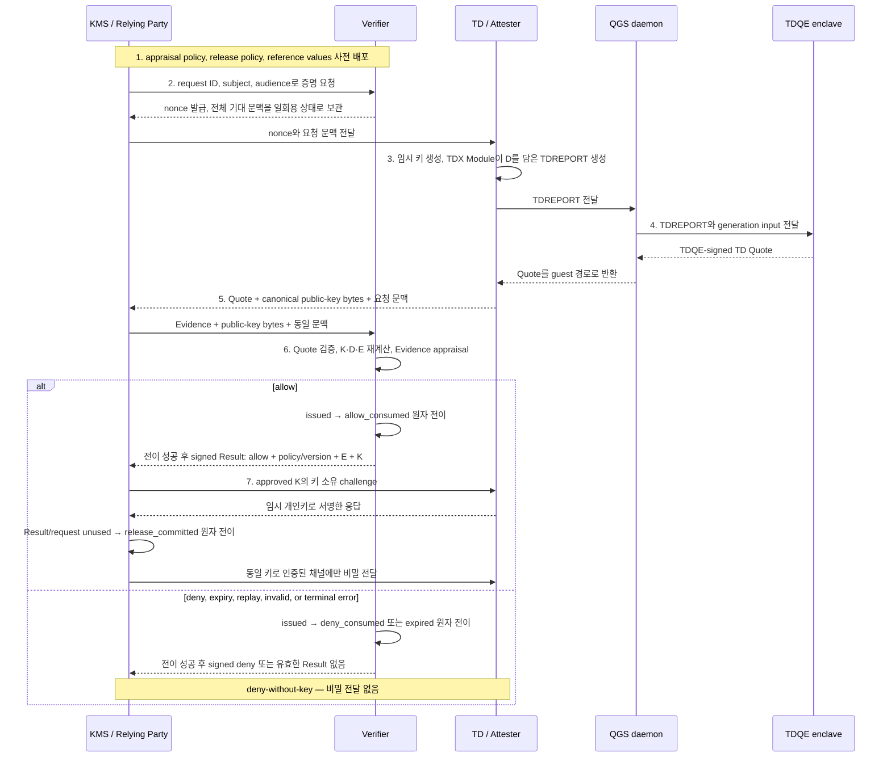
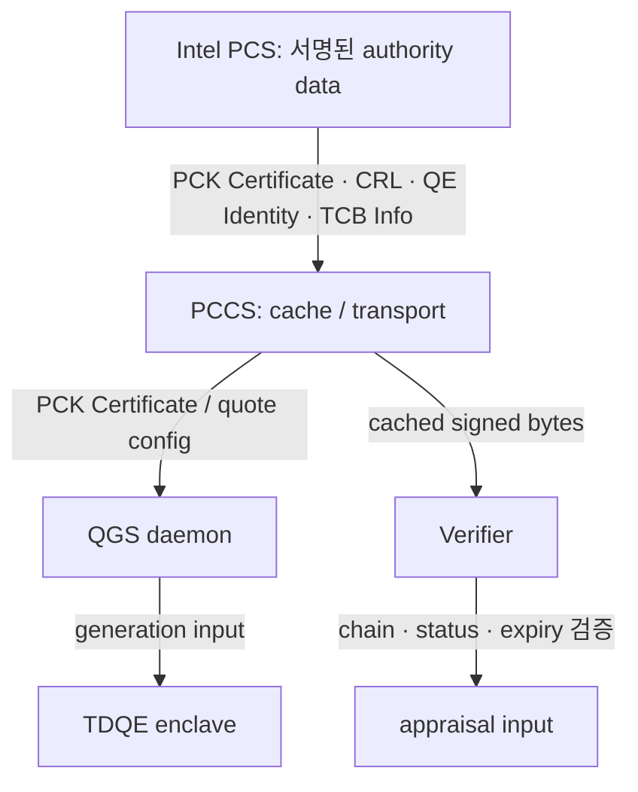

# Intel TDX 원격 증명: 승인한 VM에만 비밀을 공개하는 통제

<!-- C-001 -->
**한 줄 요약 —** Intel TDX 원격 증명은 클라우드 운영자를 전적으로 믿지 않아도, **증거 평가 서비스가 TDX VM의 하드웨어 보고를 조직 기준으로 확인하고, 키 관리 서비스가 별도 공개 정책을 통과한 VM에만 비밀을 내주게 하는 절차**다.〔S-002, S-003, S-007〕

**Intel-rats 결론 —** 이 판단 구조와 실패 경계를 배우는 시각 자료로는 강점이 있지만, 그대로 배포할 Quote 검증 참조 구현은 아니다.〔S-001〕

## 최소 역할 지도

<!-- C-002 -->
| 역할·구성요소 | 하는 일 | 신뢰 의미 |
|---|---|---|
| **TD (Trust Domain)** | TDX가 보호하는 VM. 임시 키를 만들고 TDX Module에 로컬 TDREPORT를 요청한다. | TD가 준 값은 처음부터 믿지 않고 Evidence로 평가한다. |
| **QGS daemon** | 호스트에서 TDREPORT와 Quote를 운반하고 quote generation을 조율한다. | 비-enclave 통신 경로다. 방해·재전송·교체 시도는 가능하지만 유효한 Quote를 서명하지 못한다. |
| **TDQE** | 같은 플랫폼의 TDREPORT를 확인하고 TD Quote를 서명하는 Quoting Enclave다. | 선택한 attestation-key/PCK 신뢰 체인 아래 Quote 서명 주체다. |
| **Intel PCS / PCCS** | PCS는 서명된 인증·폐기·TCB 정보의 원천, PCCS는 그 정보를 캐시·전달한다. | PCS 서명과 trust anchor를 검증한다. PCCS 캐시 자체는 권위가 아니다. |
| **Verifier (증거 평가자)** | challenge를 발급·보관하고 Quote를 검증한 뒤 측정 상태를 정책으로 평가한다. | 올바른 구현, 기준값, appraisal policy와 Result 서명키를 신뢰한다. |
| **Relying Party (실제 공개 결정자)** | KMS·데이터·API 서비스. Verifier Result를 확인하고 별도 정책으로 키·접근을 허용한다. | 승인한 Verifier key, 자체 release policy, 신뢰 가능한 시계와 허용 clock skew를 사용한다. |

이 역할은 **보호(TDX) → Evidence(TDREPORT·Quote) → 검증·평가(Verifier) → Result 사용과 행동(Relying Party)**의 네 층을 이룬다. Quote가 유효해도 자동 권한 부여는 아니다.〔S-002, S-007, S-009〕

## 위협과 신뢰 가정

<!-- C-003 -->
- **공격 가능한 경로:** 호스트·하이퍼바이저·네트워크·QGS daemon·PCCS cache는 메시지를 차단·지연·재전송·교체할 수 있다. 원격 증명은 이런 경로의 가용성을 보장하지 않는다.
- **위조를 막는 기반:** CPU와 TDX Module, TDQE와 attestation key, 허용한 PCK/Intel trust anchor, PCS 서명, Verifier 구현·정책·서명키, Relying Party 정책과 trust store를 신뢰한다.
- **TD 입력은 검증 전까지 불신:** nonce를 제외한 Attester 입력과 공개키는 Evidence 평가, digest 비교, 키 소유 증명 전에는 신뢰하지 않는다. 다만 선택한 암호 알고리즘·구현이 건전하고, 평가한 공개키의 개인키가 의도한 TD 경계 안에서 생성·보관된다고 가정한다.
- **보장과 한계:** 이 가정 아래 공격 경로는 정상 Quote·collateral·Result를 위조할 수 없지만 DoS와 replay·substitution 시도는 할 수 있다. 일회용 challenge, 서명, digest, 정책이 이를 탐지·거부한다.〔S-002, S-003, S-005, S-009〕

## 한눈에 보는 키 공개 흐름

<!-- C-004 -->
아래는 Verifier가 challenge를 발급하고 Relying Party가 Evidence를 전달하는 **Background Check형 예시**다.



Verifier의 nonce는 CSPRNG로 만들고 조직이 정한 최소 entropy를 만족해야 한다. 전송·내부 오류가 재시도 가능하더라도 기존 challenge record를 닫은 뒤 새 nonce로 다시 시작한다. allow와 deny 모두 첫 terminal appraisal에서 Verifier request 상태를 원자적으로 소비하며, Relying Party도 한 번 사용한 Result/request를 기록해 두 번째 자산 공개를 거부한다.

### Collateral은 별도의 서명·캐시 경로다

<!-- C-005 -->


PCK Certificate는 플랫폼 quoting credential의 인증서, CRL은 폐기 목록, QE Identity와 TCB Info는 허용할 quoting enclave와 플랫폼 보안 버전 상태를 판단하는 자료다. Verifier는 PCCS를 신뢰해서가 아니라 **받은 바이트의 서명·체인·상태·유효기간을 검증해서** 사용한다. PCCS `nextUpdate`, 갱신 실패, 폐기와 TCB 변경은 요청 흐름과 독립된 운영 책임이다.〔S-003, S-005〕

## 비교 가능한 세 digest와 Result profile

<!-- C-006 -->
아래 식은 구현 가능한 바이트 규격이 아니라 **반드시 만족해야 할 비교 불변조건을 나타내는 symbolic profile**이다. 실제 배포 profile은 `digest_suite_id`와 version으로 hash 알고리즘·출력 길이, key algorithm·canonical key encoding, 필드 순서·길이 구분, 그리고 D를 64바이트 `REPORTDATA`에 넣는 정확한 매핑을 모두 확정해야 한다. RFC 9334의 보편 wire format이라고 주장하지 않는다.

```text
key_bytes = canonical_public_key_bytes(key_algorithm, ephemeral_public_key)
K = Hash("tdx-ra/key/v1"      || key_algorithm || key_bytes)
D = Hash("tdx-ra/context/v1"  || canonical_encode(nonce, request_id, subject, audience, K))
E = Hash("tdx-ra/evidence/v1" || exact_TD_Quote_octets)
```

- TD는 실제 suite가 정의한 64바이트 encoding의 `D`를 `REPORTDATA`에 넣고 `{Quote, key_bytes, context}`를 보낸다.
- Verifier는 보관한 nonce와 받은 context·key bytes로 `K`와 `D`를 재계산하고 Quote의 `REPORTDATA`와 비교한다. 이어 exact Quote octets로 `E`를 계산한다.
- Verifier가 서명하는 Result에는 `profile/version, digest_suite_id, verdict, issuer, subject, audience, request_id, issued_at, expiry, appraisal_policy_id/version, evidence_digest=E`를 넣고, **allow일 때만** `approved_key_digest=K`를 넣는다.
- Relying Party는 승인한 Verifier 공개키, 허용 policy version, 자신의 subject·audience·request, 신뢰 가능한 현재 시각과 최대 clock skew, 자신이 보낸 Quote의 `E`, 받은 key bytes의 `K`를 모두 비교한다.
- 그 뒤에야 K에 대응하는 개인키의 proof of possession을 확인하고, Result/request를 `unused → release_committed`로 원자 전이한다. 전이가 성공한 한 요청만 같은 키로 인증된 채널에 비밀을 보내며, 실패하거나 이미 사용된 Result에는 공개하지 않는다.〔S-002, S-004, S-005, S-011〕

## Quote가 증명하는 것과 증명하지 않는 것

<!-- C-007 -->
| 올바르게 검증·평가하면 알 수 있는 것 | Quote만으로는 알 수 없는 것 |
|---|---|
| 선택한 신뢰 모델 아래 Quote가 허용된 quoting credential에 연결되고 변조되지 않았는지 | 측정된 코드가 정확하고 취약점이 없는지 |
| 특정 TD 측정값·속성·TCB 관련 상태가 무엇으로 보고됐는지 | 증명 뒤에도 계속 안전하게 동작할지 |
| `REPORTDATA`에 D가 묶였고 Verifier가 기대 문맥과 key bytes로 같은 D를 계산했는지 | 기대 nonce·request·시간 비교 없이 Evidence가 신선한지 |
| 보고된 측정값이 조직 기준값과 일치하는지 | TD 안의 특정 컨테이너나 프로세스가 승인됐는지 |
| 정책 판단에 사용할 하드웨어 기반 Evidence | 개인키 소유, Result 진위, 권한 부여—각각의 별도 검사가 없는 경우 |
|  | 가용성 또는 모든 부채널·I/O·공급망 위험의 제거 |

## Intel-rats: 취할 강점과 고칠 부분

<!-- C-008 -->
| 취할 강점 | 고쳐 읽을 부분 |
|---|---|
| **TD와 컨테이너 경계:** 컨테이너가 준 값을 REPORTDATA에 넣어도 컨테이너의 독립 신원이 증명되지는 않는다. 별도 workload Evidence가 필요하다. | **Background Check:** 표준은 `Attester → RP로 Evidence`, `RP → Verifier로 평가 요청`이다. 프로젝트의 Evidence 선등록 후 RP 조회 흐름은 RFC 9334와 다르다. |
| **배포 역할 연결:** TD·Guest Agent, Verifier, Key Broker, PCS/PCCS, 정책 소유자를 한 시스템 안에서 보게 한다. | **그래프 일관성:** 상위 Container–Key Broker 직접 경로와 상세 Guest Agent 경유가 다르고 일부 Verifier–RP 경로가 전달 패턴을 섞는다. |
| **Evidence와 collateral 수명주기 분리:** 요청 nonce·Quote와 인증서 캐시·만료·폐기·TCB 갱신을 다른 운영 경로로 본다. | **구현 범위:** nonce·audience·expiry·workload Evidence가 일급 타입이 아니며 Quote 구조·DCAP API·배포 코드·정책 언어가 없다. |
| **deny-without-key:** 콘텐츠 검증기가 deny 단계에서 workload key를 금지한다. | 이 검사는 교육용 시퀀스의 불변조건이지 배포 시스템의 runtime enforcement 보증은 아니다. |

<!-- C-009 -->
SGX와 TDX는 **Evidence → 검증·평가 → 정책 기반 행동**이라는 상위 구조를 공유하지만 증명 경계와 구체 메커니즘은 다르다. SGX는 enclave의 `MRENCLAVE`·`MRSIGNER` 같은 신원 중심이고, TDX는 펌웨어·OS·워크로드를 포함할 수 있는 TD 전체 VM 경계 중심이다. 따라서 TDX Quote를 한 컨테이너의 신원으로 확대 해석하면 안 된다.〔S-001, S-002, S-004, S-010, S-012〕

## 지금 내릴 결정과 첫 파일럿

<!-- C-010 -->
| 단일 책임자 | 출시 전 산출물 |
|---|---|
| **보안·플랫폼 책임자** | reference values, TCB·freshness·binding appraisal policy, 허용 policy version, 폐기·재증명 기준 |
| **보호 자산의 서비스 책임자** | Result-use/release policy, 허용 subject·audience·clock skew, fail-closed와 제한 운영 조건 |
| **플랫폼 운영** | PCS/PCCS 갱신, collateral 장애 자세, revocation-to-deny SLO, audit와 복구 절차 |
| **개발자·아키텍트** | challenge state machine, K/D/E suite, Result 검증, PoP, bound channel, negative tests, key rotation/rollback |

**첫 파일럿:** 가치가 높고 회수 가능한 단일 키 공개 경로 하나를 고른다. 다음을 모두 만족해야 출시한다.

- 위조·과거 Quote·nonce 재사용·폐기·audience 불일치·key substitution·Verifier/PCCS 장애 테스트에서 **공개된 키 0개**
- allow·deny·expiry마다 challenge 상태가 한 번만 소비되고 두 번째 결정이 만들어지지 않음
- 출시 전에 수치로 정한 collateral outage 자세, maximum clock skew, revocation-to-deny와 re-attestation SLO 충족
- appraisal/release policy 변경이 version과 승인자로 감사되며, 공개 키의 rotation·revoke·rollback 절차를 리허설함

Intel-rats는 **원격 증명의 판단 구조를 배우고 설계 리뷰 질문을 뽑는 자료**로 사용하고, 구현 기준은 RFC 9334와 현재 Intel TDX/DCAP 문서로 보완해야 한다.
